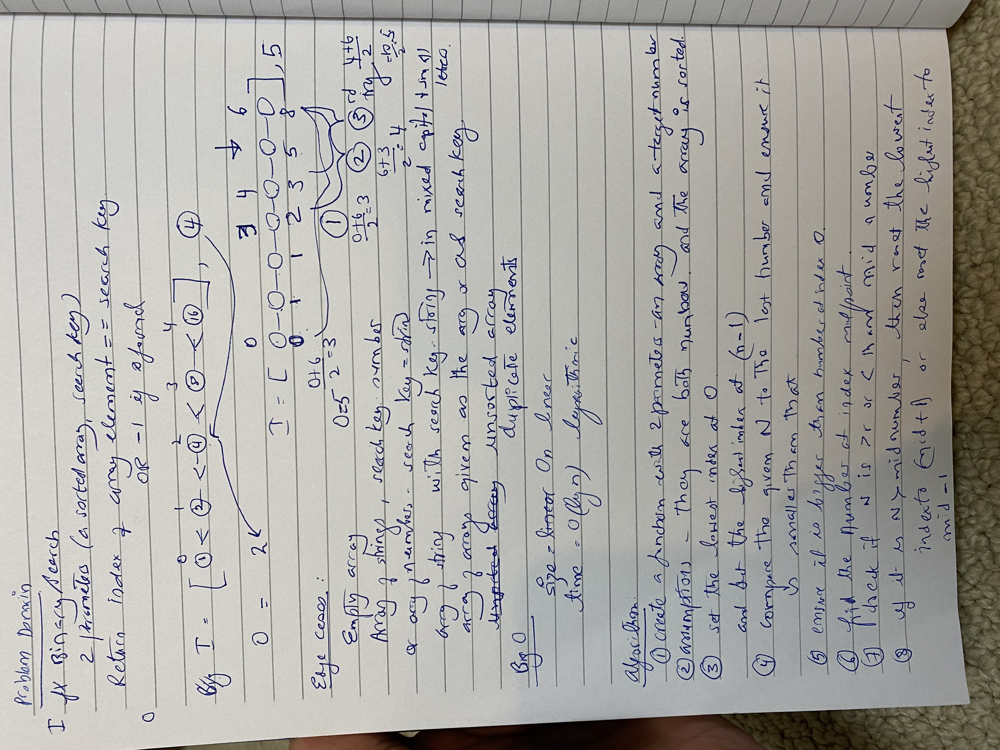
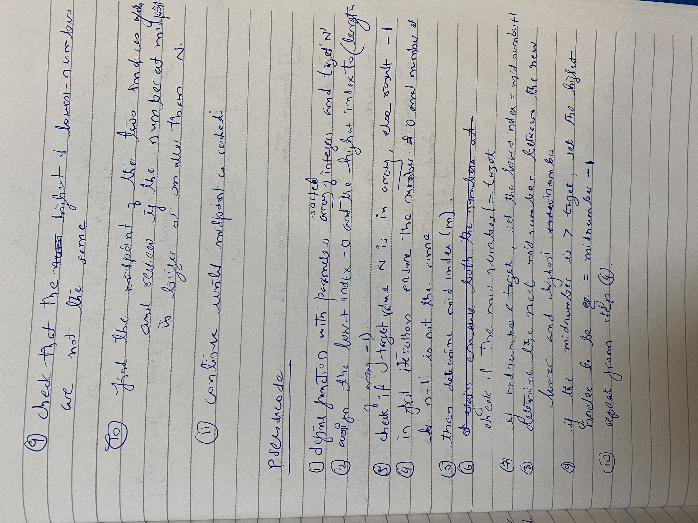

## __Array Binary Search__
### [Table of Contents](../../../README.md)
See [solution](array_binary_search.py)  
PR https://github.com/vijayetar/data-structures-and-algorithm-py/pull/1

    This is code challenge to to find a target number within an array using binary search.

* __Challenge__
    - Write a function called __BinarySearch__ which takes in __2 parameters__: a sorted array and the search key. Without utilizing any of the built-in methods available to your language, return the __index of the array’s element__ that is equal to the search key, or -1 if the element does not exist.

* __Approach & Efficiency__
    - This is an extremely efficient way to finding the index of a given element with decreasing memory used and time consumed. the efficiency in this case is affected in a logarithmic manner to base 2.

    - Compare this to the loop function which doesn't utilize the binary method, and iterates through the array to find a match

    - The ideal method would be using .index() on the array after confirming the value is present in the array.

* __Specificiations used__
    - gitignore, editorconfig

* __Solution__

* __Checklist__
- [x] Top-level README “Table of Contents” is updated
 - [x] Feature tasks for this challenge are completed
 - [ ] Unit tests written and passing
     - [ ] “Happy Path” - Expected outcome
     - [ ] Expected failure
     - [ ] Edge Case (if applicable/obvious)
 - [x] README for this challenge is complete
     - [x] Summary, Description, Approach & Efficiency, Solution
     - [x] Link to code
     - [x] Picture of whiteboard
